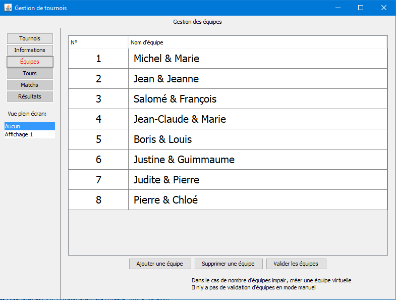
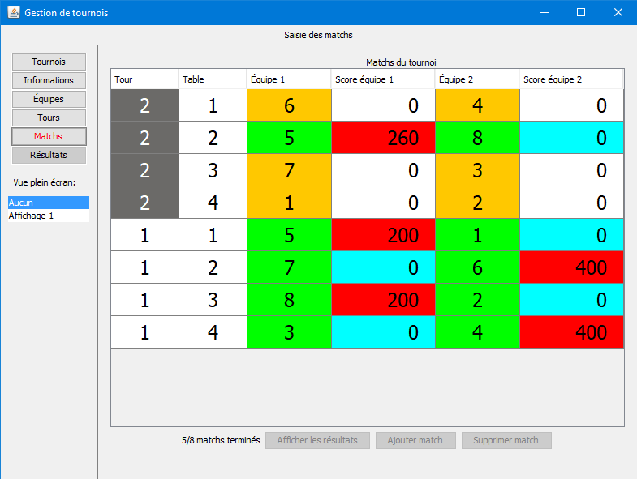
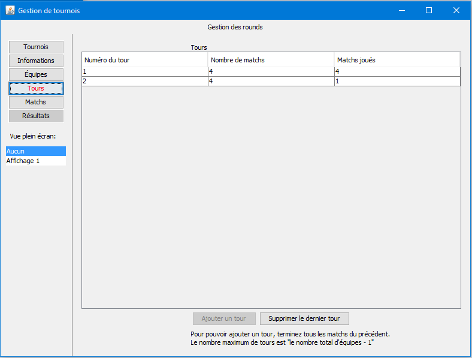
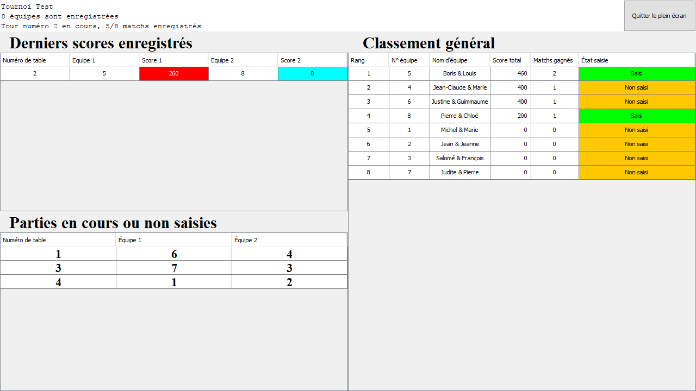

# bourgTournament

### Qu'est-ce que c'est ? 
C'est une application permettant de gérer un tournoi, par exemple un tournoi de Belote. Ce logiciel est capable de gérer:

 1. L'enregistrement d'équipes,
 2. La génération de tours, dans lesquels sont effectués des matchs,
 3. Les matchs sont générés automatiquement, de manière à éviter de faire rejouer des mêmes équipes l'une contre l'autre,
 4. Une vue plein écran pour diffuser les matchs à effectuer ainsi que les résultats sur un deuxième écran (projecteur) tout en continuant à saisir sur le PC.

Ce logiciel a été conçu à l'origine pour le tournoir de Belote de Bournazel.

N'hésitez pas à me contacter pour proposer des améliorations (louis arobase chanouha fr), voire même à reporter des bugs ou pousser vos PR.

### License
Ce logiciel est publié sous la license CC BY-NC-ND 3.0 ([lien vers la license complète en français](https://creativecommons.org/licenses/by-nc-nd/3.0/deed.fr)).
Pour résumer, vous pouvez tout faire sauf:
 1. Utiliser ce code, ou une partie du contenu de ce dépôt à des fins commerciales,
 2. Publier une version modifiée de cette application sans mon accord.

Me contacter si cela vous pose problème.

### Captures d'écran
 

### Utilisation

Vous devez ajouter le JAR HSQLDB dans votre build path [lien](http://hsqldb.org/)

